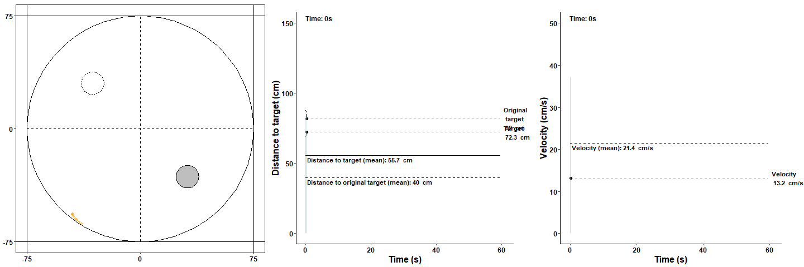
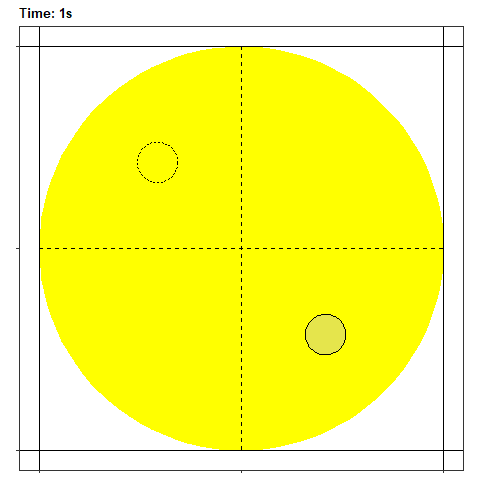
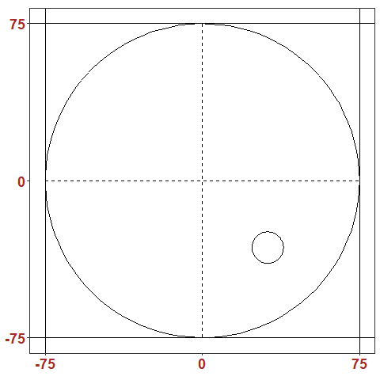

---
output:
  github_document
---

<!-- README.md is generated from README.Rmd. -->

# VisualMWM 
This R package provides functions to visualize [Morris water maze](https://en.wikipedia.org/wiki/Morris_water_navigation_task) tracking data in motion! The goal is to visualize behaviour starting from raw, unprocessed data, i.e. x and y coordinates for every time point, that is obtained with tracking software (e.g. Ethovision). This package comes with an example data set (track_data) that can be used to test the various plotting options. Plots are generated with [ggplot2](https://ggplot2.tidyverse.org/), and animations are rendered with [gganimate](https://gganimate.com/articles/gganimate.html) and [gifski](https://gif.ski/). 

<br><br>

## Let's start with an example...
```{r,  out.width = "100%", include=TRUE, eval=TRUE, echo=FALSE}
 
```

<br>
On the left we see the track of the animal in the maze. This example shows the second trial of the first day of reversal, which explains the searching behaviour close to the original target (top left circle). The GIF in the middle shows the distance to both the original as well as the new target. The GIF on the right displays the velocity of the animal during the trial. These GIFs have been stitched together with the appendGIFs function.
<br> 

## Installation
```{r, eval = FALSE, include=TRUE}
# install
devtools::install_github("Thonnard/VisualMWM")
# load
library(VisualMWM)
```

## Exemplary data set
```{r, eval = TRUE, include=FALSE}
# load some data
load("data/track_data.RData")
```

```{r, eval = TRUE}
# check data
head(track_data)
```

## Heatmaps
There are two main types of heatmaps available: raster and contour. Here we see an example of a (interpolated) raster heatmap on the left, and a (filled) contour heatmap on the right.

<center>
```{r,  out.width = "40%", include=TRUE, eval=TRUE, echo=FALSE}
 

```
</center>


## Tracking

## Distance to target

## Velocity

## Time spent per quadrant

## Merge data
VisualMWM also provides a function to merge raw data files (e.g. of different subjects, trials,...). This function is written based on Ethovision raw data output that contains extra information above the actual tracking data. Here is an example for csv files (examples are provided in tests/csv_merge):

```{r, eval = FALSE, echo = TRUE}
mergeCOORD(startData=39,rowID=34, rowDay=35, rowTrial=32, rowGroup="FOO", filetype = "csv")
```

This code produces an csv output file that contains following information (group information was added later as an example):

```{r, eval = TRUE, echo = TRUE}
head(track_data, n=3)
tail(track_data, n=3)
```

