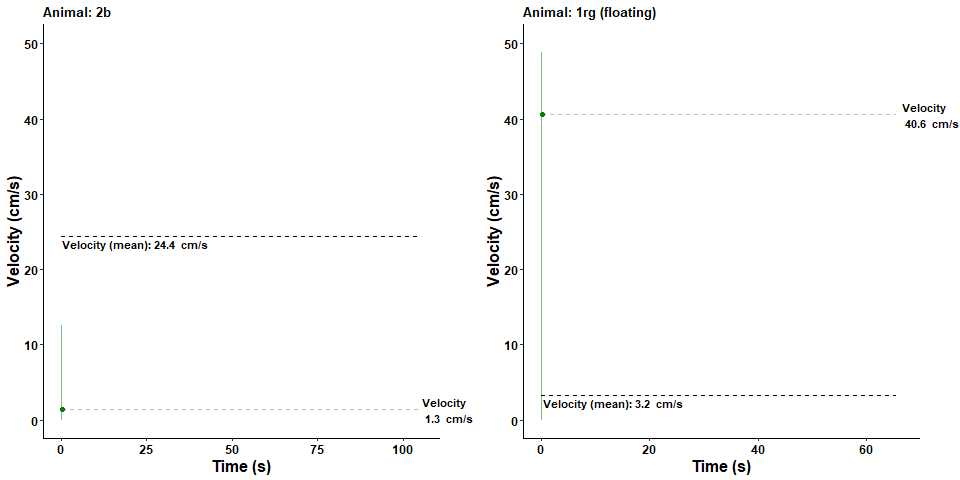

---
output:
  github_document
---

<!-- README.md is generated from README.Rmd. -->

# VisualMWM 
This R package provides functions to visualize [Morris water maze](https://en.wikipedia.org/wiki/Morris_water_navigation_task) tracking data in motion! The goal is to visualize behaviour starting from raw, unprocessed data, i.e. x and y coordinates for every time point, that is obtained with tracking software (e.g. Ethovision). This package comes with an example data set (track_data) that can be used to test the various plotting options. Plots are generated with [ggplot2](https://ggplot2.tidyverse.org/), and animations are rendered with [gganimate](https://gganimate.com/articles/gganimate.html) and [gifski](https://gif.ski/). 

<br>

## Let's start with an example...
```{r,  out.width = "100%", include=TRUE, eval=TRUE, echo=FALSE}
knitr::include_graphics("man/figures/example1.gif") 
```

<br>
On the left we see the track of the animal in the maze. This example shows the second trial of the first day of reversal, which explains the searching behaviour close to the original target (top left circle). The GIF in the middle shows the distance to both the original as well as the new target. The GIF on the right displays the velocity of the animal during the trial. These GIFs have been stitched together with the appendGIFs function.
<br> 

## Installation
```{r, eval = FALSE, include=TRUE}
# install
devtools::install_github("Thonnard/VisualMWM")
# load
library(VisualMWM)
```

## Exemplary data set
```{r, eval = TRUE, include=FALSE}
# load some data
load("data/track_data.RData")
```

```{r, eval = TRUE}
# check data
head(track_data)
```

## Heatmaps
There are two main types of heatmaps available: raster and contour. Here we see an example of a raster heatmap (interpolated) on the left, and a (filled) contour heatmap on the right. Heatmaps are plotted 2D [kernel density estimations](https://en.wikipedia.org/wiki/Kernel_density_estimation). 

```{r,  out.width = "80%", include=TRUE, eval=TRUE, echo=FALSE, fig.align="center"}
knitr::include_graphics("man/figures/heatmap_example.gif") 
```


### Another example...
Several other options are available to plot heatmaps. Documentation of all VisualMWM functions can be found [here](https://rdrr.io/github/Thonnard/VisualMWM/man/).

```{r,  out.width = "40%", include=TRUE, eval=TRUE, echo=FALSE, fig.align="center"}
knitr::include_graphics("man/figures/heatmap_example2.gif") 
```

```{r, eval = FALSE, echo = TRUE}
heatmapGIF(data=track_data, id="2b", day=1, trial=1, 
           centerx=19.4, centery=-1.4, platformx=50.60, platformy=-33.34,
           type="contour", contour_filled=FALSE, contour_colour_scaled=TRUE, 
           heatmap_low = "brown", heatmap_high = "blue",
           theme_settings = list(axis.text = element_text(face="bold", color="brown", size=16)),
           loop = TRUE)
```


## Tracking
Track GIFs display the animal's track over time. Several parameters can be adjusted (e.g. quadrant colours, platform linestyle, track colour, etc.).

```{r,  out.width = "40%", include=TRUE, eval=TRUE, echo=FALSE, fig.align="center"}
knitr::include_graphics("man/figures/track_example1.gif") 
```

```{r, eval = FALSE, echo = TRUE}
trackGIF(data=track_data, id="2b", day=1, trial=2,
         centerx=19.4, centery=-1.49, platformx=50.60, platformy=-33.34, 
         platform_alpha=1, platform_colour="grey", track_colour="darkblue", track_alpha=0.35, 
         quadrant_colours=c("white", "white", "white", "lightblue"), quadrants_alpha = 0.4,
         theme_settings = list(axis.text = element_text(face="bold", color="black", size=16)),
         plot_original_platform = TRUE, original_platform_colour=NA, loop = TRUE)
```

## Distance to target
Typically, trial duration (latency to target) is the first behavioural readout that is checked when analyzing Morris water maze data. However, this parameter is correlated with the animal's velocity. In case there is a group difference in velocity, it is a good idea to check the distance to target as well. 

Next example shows the distance to target on the first and fourth trial during the first day of reversal. These GIFs clearly show that the animal spent more time in the vicinity of the original platform, compared to the reversal platform, on the first trial, but not on the fourth.

```{r,  out.width = "80%", include=TRUE, eval=TRUE, echo=FALSE, fig.align="center"}
knitr::include_graphics("man/figures/distance_example.gif") 
```

```{r, eval = FALSE, echo = TRUE}
# First day of reversal, trial 1
targetdistanceGIF(data=track_data, id="2rb", day=1, trial=1, 
                  centerx=19.4, centery=-1.49, platformx=50.60, platformy=-33.34,
                  show_time = TRUE, plot_original_target = TRUE, loop = TRUE,
                  title="Distance to target (reversal, day 1, trial 1)")

# First day of reversal, trial 4
targetdistanceGIF(data=track_data, id="2rb", day=1, trial=4, 
                  centerx=19.4, centery=-1.49, platformx=50.60, platformy=-33.34,
                  show_time = TRUE, plot_original_target = TRUE, loop = TRUE,
                  title="Distance to target (reversal, day 1, trial 4)")
```

## Velocity
Floating or freezing behaviour can be demonstrated in velocity graphs. Following GIF shows the difference between normal swimming behaviour (left) and floating (right). 

```{r,  out.width = "80%", include=TRUE, eval=TRUE, echo=FALSE, fig.align="center"}
 
```

```{r, eval = FALSE, echo = TRUE}
# Normal swimming behaviour
velocityGIF(data=track_data, id="2b", day=1, trial=1, centerx=19.4, centery=-1.4, 
            platformx=50.60, platformy=-33.34, title = "Animal: 2b", loop = TRUE)

# Floating
velocityGIF(data=track_data, id="1rg", day=1, trial=4, centerx=19.4, centery=-1.4, 
            platformx=50.60, platformy=-33.34, title = "Animal: 1rg (floating)", loop = TRUE)
```

## Time spent per quadrant
Time spent per quadrant can be a good indicator of the learning process. For instance, during probe trials (i.e., trials where the platform is absent), the position of the animal is a good measure of reference memory. 

```{r,  out.width = "40%", include=TRUE, eval=TRUE, echo=FALSE, fig.align="center"}
knitr::include_graphics("man/figures/bargraph.gif") 
```

```{r, eval = FALSE, echo = TRUE}
barGIF(data=track_data, id="2rb", day=1, trial=1, loop = TRUE
       centerx=19.4, centery=-1.4, platformx=50.60, platformy=-33.34)
```

VisualMWM also provides functions to display behaviour in static graphs. Next example shows two area plots of time spent per quadrant. Here we can clearly see that during the fourth trial of reversal (right), compared to the first trial (left), relatively more time is spent in the target quadrant ([viridis colour scales](https://cran.r-project.org/web/packages/viridis/vignettes/intro-to-viridis.html)).


```{r, eval = FALSE, echo = TRUE}
# Reversal, trial 1
areaQuadrantTime(data=track_data, id="1w", day=1, trial=1, device="jpeg",
                 centerx=19.4, centery=-1.4, radius=75, platformx=50.60, platformy=-33.34, platformradius=7.5)

# Reveral, trial 4
areaQuadrantTime(data=track_data, id="1w", day=1, trial=4, device="jpeg",
                 centerx=19.4, centery=-1.4, radius=75, platformx=50.60, platformy=-33.34, platformradius=7.5)
```

## Merge data
VisualMWM also provides a function to merge raw data files (e.g. of different subjects, trials,...). This function is written based on Ethovision raw data output that contains extra information above the actual tracking data. Here is an example for csv files (examples are provided in tests/csv_merge):

```{r, eval = FALSE, echo = TRUE}
mergeCOORD(startData=39,rowID=34, rowDay=35, rowTrial=32, rowGroup="FOO", filetype = "csv")
```

This code produces an csv output file that contains following information (group information was added later as an example):

```{r, eval = TRUE, echo = TRUE}
head(track_data, n=3)
tail(track_data, n=3)
```

## Workflow
(under construction...)

