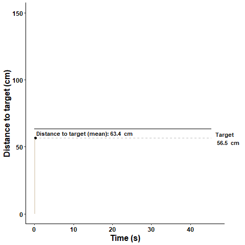

VisualMWM
================
David Thonnard
4/16/2020

<!-- README.md is generated from README.Rmd. Please edit that file -->

``` r
# load some data
load("data/track_data.RData")

# check data
head(track_data)
#>   Time       x       y Animal Day Trial Group
#> 1 0.00 95.4989 12.2106     1w   1     1     A
#> 2 0.04      NA      NA     1w   1     1     A
#> 3 0.08      NA      NA     1w   1     1     A
#> 4 0.12 95.4611 12.3342     1w   1     1     A
#> 5 0.16 95.5266 12.0585     1w   1     1     A
#> 6 0.20 95.5048 12.1942     1w   1     1     A
```

My title

